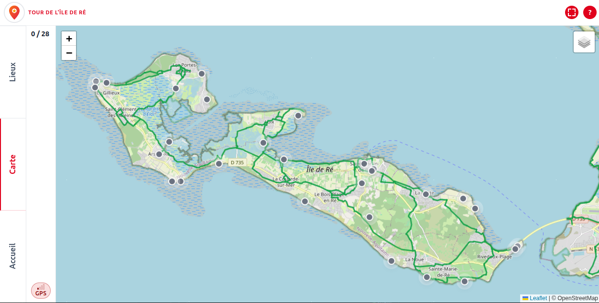

# geo-hunt

Application web statique pour organiser un jeu de piste géolocalisé sur smartphone.
Le participant valide des lieux réels en entrant dans des zones GPS et découvre des récompenses (mots de solution, défis photo, messages).



## But du logiciel

- Préparer rapidement un jeu terrain à partir d'un JSON source.
- Déployer une application web sans backend.
- Faire jouer les participants depuis leur navigateur mobile.

## Fonctionnement du jeu (version courte)

1. Le joueur ouvre l'application et autorise la géolocalisation.
2. Il se rend sur un lieu de la carte.
3. L'application vérifie si sa position est dans le rayon autorisé.
4. Si oui, le lieu est validé et une récompense est affichée.
5. Les validations restent enregistrées localement sur l'appareil.

## Développement assisté par IA

Ce projet a été développé avec l’assistance d’outils d’intelligence artificielle (notamment GitHub Copilot).

L’ensemble du code a fait l’objet d’une relecture, de validations et, le cas échéant, d’adaptations par un humain afin de garantir sa cohérence et sa qualité.

Toutefois, aucune garantie n’est apportée quant à l’originalité complète du code ni à l’absence éventuelle d’éléments provenant de sources tierces. 

## Comment l'utiliser

### 1) Préparer la configuration

- Éditez le descripteur source (exemple : `scripts/ile_de_re.json`).
- Générez la configuration runtime :

```bash
node scripts/build-zones.js ./scripts/ile_de_re.json --check
node scripts/build-zones.js ./scripts/ile_de_re.json --force
```

### 2) Démarrer en local

Servez le dossier avec un serveur statique :

```bash
npx serve .
```

Puis ouvrez l'URL locale dans le navigateur.

## Script build-zones (explication courte)

Le script `scripts/build-zones.js` prend un descripteur source et génère :

- `gameConfig.json` : configuration lue par l'application.
- `print/carte_des_lieux.html` : carte imprimable d'aide terrain.

Options principales :

- `--check` : valide uniquement.
- `--force` : autorise l'écrasement des fichiers générés.

## Déploiement Vercel

1. Importez le dossier dans un projet Vercel.
2. Déployez en statique (sans framework).
3. Vérifiez que `vercel.json` est bien appliqué.
4. Testez l'URL publique sur iPhone et Android.

## Documentation détaillée

Les détails complets (logique interne, configuration JSON, exploitation) sont dans le dossier docs :

- [Index de la documentation](docs/README.md)
- [Logique complète du jeu](docs/logique-du-jeu.md)
- [Configuration JSON détaillée](docs/configuration-du-jeu.md)
- [Architecture et exploitation](docs/architecture-et-exploitation.md)
